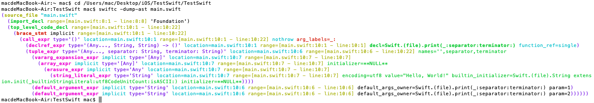
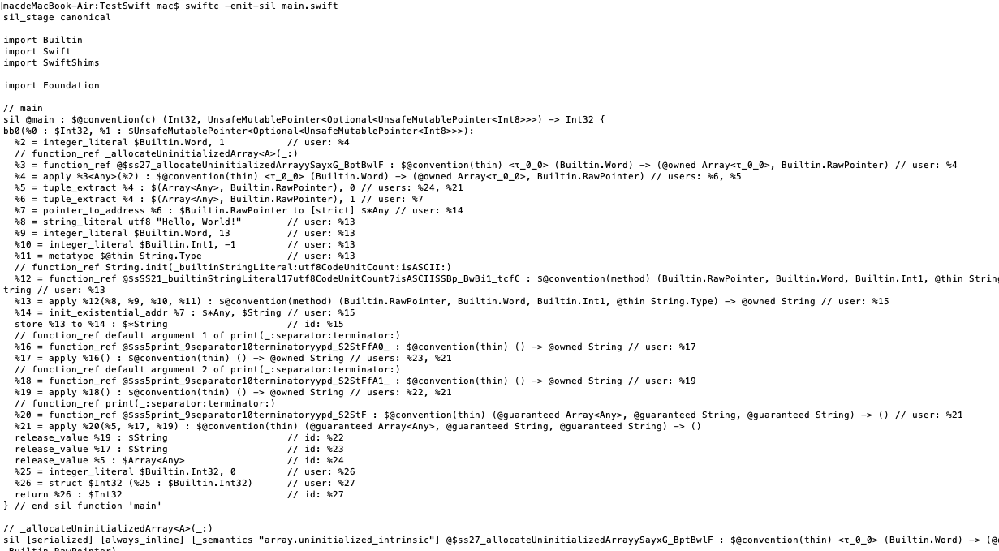

查看swift版本

```shell
xcrun swift -version
```


4层结构

Cocoa Touch：与用户有关

Media

Core Services：对下层服务面向对象的封装

Core OS: Unix系统（基于C）


swift强类型语言

[Swift教程](https://swiftgg.gitbook.io/swift/swift-jiao-cheng)

https://swiftgg.gitbook.io/swift/huan-ying-shi-yong-swift/03_a_swift_tour


编译器：

1. 前端：词法分析等（swiftc）
2. 后端：生成对应平台的二进制文件（LLVM）


ABI (Application Binary Interface)：应用程序二进制接口

- 应用程序与操作系统之间的**底层**接口
- 涉及内容：目标文件格式、数据类型的大小/布局/对齐，函数调用约定(利用栈还是寄存器)等


swiftc

- 生成语法树：`swiftc -dum-ast main.swift`



- 生成最简洁的SIL代码（中间代码）：`swiftc -emit-sil main.swift`



- 生成LLVM IR代码：`swiftc -emit-ir main.swift -o main.II`

- 生成汇编代码：`swiftc -emit-assembly main.swift -o main.s`


- 不同编写main函数，swift将全局范围内的首句可执行代码作为程序入口
- 一句代码尾部可以省略分号`;`，多句代码写在同一行时必须用分号隔开
- 用`var`定义变量，`let`定义常量，编译器能自动推断出变量/常量的类型


### playground

cmd+shift+enter 运行整个playground代码

shift+enter 运行到光标所在行


### 基础部分

#### 类型声明

常量和变量在使用之前必须声明，用 `let` 来声明常量，用 `var` 来声明变量。

常量

- 只能赋值一次
- 其值不要求在编译时期确定，但使用之前必须赋值一次
- 常量、变量在初始化之前都不能使用

#### 注释

```swift
//单行注释

/*
多行注释
*/

/*

/*
可嵌套多行注释
*/
*/

//markup语法（类似markdown）仅在playground中有效
//Editor->Show rendered markup
//: # 一级标题

/*:
# 一级标题
## 二级标题

## 笔记
> This is a note

## 图片
 
 //本地图片需要注明"Local image"
*/

//生成playground上一页/下一页链接
//: [Previous](@previous)
//: [Next](@next) 

```


#### 常见数据类型

1. 值类型：
   - 枚举(emun) Optional
   - 结构体(struct) Bool, Int, Float, Double, Character（字符，可存储ASCII、Unicode字符）; String , Array, Dictionary, Set

2. 引用类型：类(class)

- 类型别名`typealias AudioSample = UInt16`

##### 整数类型

Int8, Int16, Int32, Int64, UInt8, UInt16, UInt32, UInt64

`min`,`max`获取对应类型的最小/最大值  eg.`Int16.max`

##### 浮点数

Double (默认)、Float

##### 布尔值


##### 可选类型optional

处理可能缺失的情况，可选类型表示两种可能：有/无

`nil` 只能表示可选类型的缺省值，而不能用于非可选的常量和变量

可选值的**强制解析**：在可选参数后面加感叹号`!`可获取可选值（解析前必须确定可选值非nil）

```swift
let possibleNumber = "123"
let convertedNumber = Int(possibleNumber)
if convertedNumber != nil {
  print("convertedNumber contains some integer value.")
  print("convertedNumver has an integer value of \(convertedNumver!).")
}
```


```swift
var a: Int? = 123
print(a ?? 10) //123，有值时输出值，没有时输出??后面的值
print(a!)  //输出123， 在有明确值的时候用!输出值
```


##### 字符串

字符串插值：把常量名或者变量名当做占位符加入到长字符串中，Swift 会用当前常量或变量的值替换这些占位符。将常量或变量名放入圆括号中，并在开括号前使用反斜杠将其转义：

```swift
var price = 20
print("The price is \(price).")
```


#### 复合类型

##### 数组、集合、元组

```swift
//1.数组
var arr1: [Int] = [1, 2, 3]


//2.集合
var set1 = Set([1, 2, 3, 2]) //{2,3,1}
var set2: Set<Int> = Set<Int>([1, 2, 3, 2])


//3.元组
var http404Error = (404, "Not Found")
http404Error.0 //404
//可以对单个元素进行命名
var name = (first: "Taylor", last: "Swift")
//通过名称/位置访问元组的元素
name.first //或 name.0 
//元组创建后可以改变元素值，但不能改变元素名称/类型
//name = (first: "LiLei", sex: "male") //报错
```


##### 字典

```swift
//创建字典
let favoriteColor = [
  "Anna": "Blue",
  "Bob": "Black"
]
favoriteColor["Anna"] //"Blue"
favoriteColor["Cindy"] //nil
//设置默认值
favoriteColor["Cindy", default: "Unknown"] //"Unknown"(如果字典中找不到"Cindy"，则返回设置的默认值"Unknown")
```


##### 创建空合集

```swift
//1.使用尖括号来声明类型信息
var emptyArr = Array<Int>()   //创建空数组
var emptyDict = Dictionary<String, Int>()  //创建空字典
var emptySet = Set<String>()  //创建空集合

//2.特殊语法：Swift只为字典和数组提供了特殊的语法
var emptyArr1 = [Int]() 
var emptyDict1 = [String: Int]() 
```


##### 枚举

```swift
enum Planet: Int {
  case mercury = 1 //枚举原始值：默认从0开始
  case venus
  case earth(radius: Double) //可以附加枚举的关联值，添加额外细节信息
  case mars
}
let earth = Planet.earth(radius: 6371.4) //设置枚举关联值
```


#### 类型转换

类型()

```swift
print("value = " + String(1.5))
```


#### 基本运算符

##### 空合运算符`a ?? b`

对可选类型a进行空判断，如果a包含一个值就进行解包，否则返回默认值b。

- a必须为可选类型，b的类型必须与a存储值的类型一致
- **短路求值**：如果a非空，则b不会被计算

```swift
let defaultColorName = "red"
var userDefinedColorName: String?
var colorNameToUse = userDefinedColorName ?? defaultColorName
```

##### 区间运算符

1. 闭区间运算符：`a...b` [a,b]

2. 半开区间运算符：`a..<b` [a,b)

3. 单侧区间（让区间朝一个方向尽可能的远）：`arr[2...]`, `arr[...2]`, `arr[..<2]`

   `arr[2...]`表示往一侧无限延伸的区间，数组从索引2到结尾的所有值的区间

4. 字符、字符串也能使用区间运算符，但默认不能用在for-in中

5. 带间隔的区间值 

   ```swift
   //1.闭区间运算符
   let names = ["Anna", "Amy", "Bob", "Tom"]
   for i in 0...2{  //i默认为let常量
     print(names[i])
   }
   for var i in 1...3 { //若需要修改i，则可以显式声明为var
     i += 5
     print(i)
   }
   for _ in 1...3 { //若没有用到i，最好用_代替
     print("123") 
   }
   for name in names[0...3] {
     print(name)
   }
   
   //3.单侧区间
   let range = ..5  //无穷小到5
   range.contains(7) //false
   range.contains(-1) //true
   
   //4.字符、字符串使用区间运算符
   //字符串使用区间运算符
   let stringRange = "cc"..."ff" //cc,cd,...,cz,da,..,ff
   stringRange.contains("cb") //false
   stringRange.contains("dz") //true
   //字符使用区间运算符
   let characterRange: ClosedRange<Character> = "a"..."f"
   
   //5.带间隔的区间值
   //起始为4，终止为10，间隔为2 
   //输出：4, 6, 8, 10
   for i in stride(from: 4, through: 10, by: 2) {
     print(i)
   }
   ```

   

##### 逻辑运算符

`!a`, `a && b`, `a || b`

`||`和`&&`遵循左结合，最左边的优先计算


### 控制流

#### switch

- 必须保证能够处理**所有情况**
- 一种情况结束不用加break
- case和default后面不能加大括号`{}`，且其后面至少有一条语句
- 如果某种情况下不想做任何事，加一个break即可

- 复合条件：两种情况执行同一语句`fallthrough`（希望继续执行下一个case的代码）

```swift
let age = 1
switch age {
case 1:
    fallthrough //复合条件，用fallthrough
case 2:
    print("1 or 2")
case 3, 4: //复合条件，直接用,隔开
  	print("3 or 4")
default:
    break
}

//元组匹配
let point = (1, 2)
switch point {
case (0, 0):
    print("The origin")
case (_, 0):
    print("On the x-axis")
case (0, _):
    print("On the y-axis")
case (-2...2, -2...2):
    print("Inside the box")
default:
    print("Outside the box")
}

//where

```


#### 控制转移语句

- continue
- break
- fallthrough 
- return
- throw

#### where


#### 标签语句

可以使用标签（*statement label*）来标记一个循环体或者条件语句，对于一个条件语句，你可以使用 `break` 加标签的方式，来结束这个被标记的语句。对于一个循环语句，你可以使用 `break` 或者 `continue` 加标签，来结束或者继续这条被标记语句的执行。


#### guard

guard语句要求条件为真时执行guard语句大括号后的代码。一个guard语句后总跟一个else语句，表明如果条件不为真则执行else从句中的代码。

可以将变量或常量的可选绑定作为guard语句的条件，以保护guard语句后面的代码

```swift
func greet(person: [String: String]) {
  guard let name = person["name"] else {
    return
  }
  print("Hello \(name)!")
}
```


### 函数

#### inout关键字

形参默认是常量let，也只能是let

```swift
func greet(person: String) -> String {
  return "Hello, " + person + "!"
}
print(greet(person: "Anna"))
```


可以利用关键字`inout`，通过传引用/地址的方式修改形参值

```swift
//inout传引用
func add10(param: inout Int) {
  param += 10
  print(param)
}
var a = 10
print("传递前 a = \(a)") //10
add10(&a)
print("传递后 a = \(a)") //20
```


```swift
func multiply(_ operand: Int, by otherOperand: Int) -> Int {
  return operand * otherOperand
}
multiply(5, by: 6)
```

参数标签：外部名称  `_`表示不使用参数标签

参数名称：内部名称


#### 函数类型

函数类型由参数类型和返回值类型组成

```swift
//函数类型
var a: () -> Void //没有参数，没有返回值
var b: (Int, String) -> String //Int和String参数类型，String类型返回值
var c: (Bool, Array<Int>) -> String //Bool和Array<int>参数类型，String类型返回值
print("变量a的类型 = \(type(of: a))") //变量a的类型 = () -> ()
```


利用闭包语法in

```swift
func testFunc2(param: [Int]) ->String {
    var temp: String = ""
    for item in param {
        temp += String(item)
    }
    return temp
}

//testFunc2_a：函数类型
var testFunc2_a: ([Int]) -> String = testFunc2
var array = [1, 2, 3]
print(testFunc2(param: array))
print(testFunc2_a(array))

//testFunc2_b：函数类型，内部实现了与testFunc2一致的匿名函数
var testFunc2_b: ([Int]) -> String = { (param: [Int]) -> String in //in不可省略
    //以下为实现方式
    var temp = ""
    for item in param {
        temp += String(item)
    }
    return temp
}
print(testFunc2_b(array))
```


##### 函数类型作为参数类型

```swift
func calculate(param: (Int, Int) -> Int) -> Int {
    let value = param(1, 2)
    return value
}
func add(a: Int, b: Int) -> Int {
    return a + b
}
func minus(a: Int, b: Int) -> Int {
    return a - b
}
print(calculate(param: add))
print(calculate(param: minus))
```


##### 函数类型作为返回类型

```swift
func add(a: Int, b: Int) -> Int {
    return a + b
}
func minus(a: Int, b: Int) -> Int {
    return a - b
}

//cal函数的返回值为函数类型
func cal(param: Bool) -> (Int, Int) -> Int {
    return param ? add : minus
}
var tmp = cal(param: true)
print(tmp(1,2))
```


#### 嵌套函数

在函数里面定义函数

```swift
//calculateNested:内嵌函数
func calculateNested(param: Bool) -> (Int, Int) -> Int {
    func add(a: Int, b: Int) -> Int {
        return a + b
    }
    func minus(a: Int, b: Int) -> Int {
        return a - b
    }
    return param ? add : minus
}
var tmpNested = calculateNested(param: true)
print(tmpNested(1,2))
```


### 闭包

自包含的函数代码块，可以在代码中被传递和使用。闭包可以捕获和存储其所在上下文中任意常量和变量的引用

```swift
var closureFunc: () -> Void = {() -> Void in
   print("closureFunc")
}
```


#### 闭包的简化

```swift
//示例1
func test1(param: () -> Void) {
    param()
}
test1(param: {() -> Void in
    print("testA")
})
test1(param: {print("testB")})
test1{print("testC")}

//示例2
func test2(param: (Int) -> Void) {
    param(10)
}
test2(param: {(value: Int) -> Void in
    print(value)
})
test2(param: {(value) in
    print(value)
})
test2{(value) in
    print(value)
}

//示例3
func test3(param: (Int, Int) -> Int) {
    print(param(10, 20))
}
test3(param: {(item1: Int, item2: Int) -> Int in
    return item1 + item2
})
test3(param: {return $0 + $1})
test3(param: {$0 + $1})
```


#### 尾随闭包

```swift
ForEach(0..<4, content : { index in
                    ZStack(content: {
                    RoundedRectangle(cornerRadius: 10.0).fill(Color.white)
                    RoundedRectangle(cornerRadius: 10.0).stroke(lineWidth: 3)
                    Text("👻")
                })
            })

```


```swift
var array1 = [1, 3, 5, 0, 8, 2]
array1.sort(by: {(a, b) -> Bool in
    return a < b
})
```


### 枚举

Swift的枚举成员在创建时不会被赋予一个默认的整型值，枚举成员本身就是完备的值。每个枚举定义了一个全新的类型

#### 定义

```swift
//定义枚举类型
enum Direction {
    case north
    case south
    case east
    case west
}

//多个成员值可以写在同一行，用逗号隔开
enum Direction1 {
    case north, south, east, west
}
```


#### switch语句匹配枚举值

```swift
var direction = Direction.south
//direction = .north   //若变量的枚举类型已知，可以用.将变量赋值为该类型的另一个枚举成员

//switch
switch direction {
case .north:
    print("Direct to north")
case .south:
    print("Direct to \(direction)") // Direct to south
default:
    print("Direct to \(direction)")
}
```


#### 遍历枚举成员

让枚举遵循`CaseIterable`协议，利用`allCases`属性进行遍历

```swift
enum Fruit: CaseIterable {
    case apple, orange, banana
}

for fruit in Fruit.allCases {
    print(fruit)
}

print(type(of: Fruit.allCases)) //Array<Fruit>
```


#### 关联值

把枚举成员值与其它类型的值（关联值）一起存储，可以在使用该枚举成员时，使用/修改关联值

- 枚举类型的变量和常量在同一时间只能存储某一个枚举成员(类似union)
- 可以通过let/var提取每个枚举成员的关联值
- 如果一个枚举成员的所有关联值都被提取为常量/变量，可以在成员名称前标注let/var

```swift
enum Job {
    case developer(year: Int)
    case doctor(year: Int, department: String)
    case teacher(year: Int)
}
//可以通过var或let提取每个枚举成员的关联值(如下例中 `.developer(let year)`)
//如果一个枚举成员的所有关联值都被提取为常量/变量，可以在成员名称前标注let/var(如下例中 `let .teacher(year)`)
var job = Job.developer(year: 5)
job = .developer(year: 6)
switch job {
case .developer(let year), .doctor(let year, _), let .teacher(year):
    print("You have \(year) year(s) of experience.")
}
```


#### 原始值

每个原始值在枚举声明中必须唯一

使用原始值为整数/字符串类型的枚举时，不需要显式为每个枚举成员设置原始值，swift会自动赋值

- 整数类型：如果第一个枚举成员没有设置原始值，则默认从0开始，依次递增1

- 字符串类型：每个枚举成员的默认原始值为该枚举成员的名称

```swift
enum Direction2: Int { //需要声明类型
    case north, south, east, west
}
let direction2 = Direction2.north
print(direction2.rawValue)  //0

enum Direction3: String {
    case north, south, east, west
}
let direction3 = Direction3.north
print(direction3.rawValue) //north
```


- 可以利用原始值初始化枚举实例

```swift
//利用原始值初始化实例，由于不一定能找到匹配的枚举成员，因此得到的是可选值
var direction2_1 = Direction2(rawValue: 1) 
print(direction2_1!)
```


### 类和结构体

只需在单一的文件中定义一个结构体或者类，系统将会自动生成面向其它代码的外部接口

#### 结构体

- 结构体函数内部修改结构体数据成员时需要加`mutating`
- 使用结构体内的静态变量时，只能用结构体名称而无法用实例名称调用

```swift
struct Student {
    var name = "unknown"
    var age = 0
  
    //静态变量
    static let schoolName = "Stanford"
    
  	//初始化函数
    init() {}
    init(name: String, age: Int) {
        self.name = name
        self.age = age
    }
  
    func getName() -> String {
        return self.name
    }
    func getAge() -> Int {
        return self.age
    }
  
  	//结构体函数内部修改结构体数据成员时需要加mutating
    mutating func setAge(age: Int) {
        self.age = age
    }
}

//使用结构体内的静态变量时，只能用结构体名称而无法用实例名称调用
print("School:", Student.schoolName)
```


struct vs class

vars, constant lets, functions, initializers（用于初始化）

异

| struct                                                       | class                                                    |
| ------------------------------------------------------------ | -------------------------------------------------------- |
| Value type                                                   | Reference Type                                           |
| Copied when passed or assigned                               | Passed around via pointers                               |
| Copy on write                                                | Automatically reference counted(引用计数)                |
| Functional programming                                       | Object-oriented programming                              |
| No inheritance                                               | Inheritance (single) 单继承                              |
| "Free" init initializes **ALL** vars                         | "Free" init initializes **NO** vars                      |
| Mutability must be explicitly stated(需要显式说明是否可变)   | Always mutable(可变)                                     |
| Your "go to" data structure                                  | Usef in specific circumstances                           |
| Everything you're seen so far is a struct (expect View which is a protocol) | The ViewModel in MVVM is always a class (UIKit<旧版iOS>) |

class更容易共享，因为class位于堆中，并且有指针


private(set)：只有class本身可以修改，但是对其它都可见


Foundation：包含字典、字符串、int和Bool以及所有基本类型


#### Lesson 2

设计模式（MVVM）

Model-View-ViewModel

- Model: UI independent    Data + Logic     "The Truth"
- View: Reflects the Model      stateless, declared, reactive
- ViewModel: Binds View to Model   Interpreter


MVC

Model-View-Controller

- Model: What your application is (but not how it is displayed)
- Controller: How your Model is presented to the user (UI logic)
- View: Your controller's minions


### 常见问题

Q: 显示preview

导航栏->Editor->Canvas

**Q: could not insert new outlet connection: could not find a class named ViewController**

Xcode > Product > Clean Build Folder

重启Xcode


**Q：xcode打开playground运行很慢/无法输出**

1. 关闭Xcode
2. 在终端里执行2段代码

```
rm -rf ~/Library/Developer/CoreSimulator/Devices
killall -9 com.apple.CoreSimulator.CoreSimulatorService
```

再重新打开playground文件

